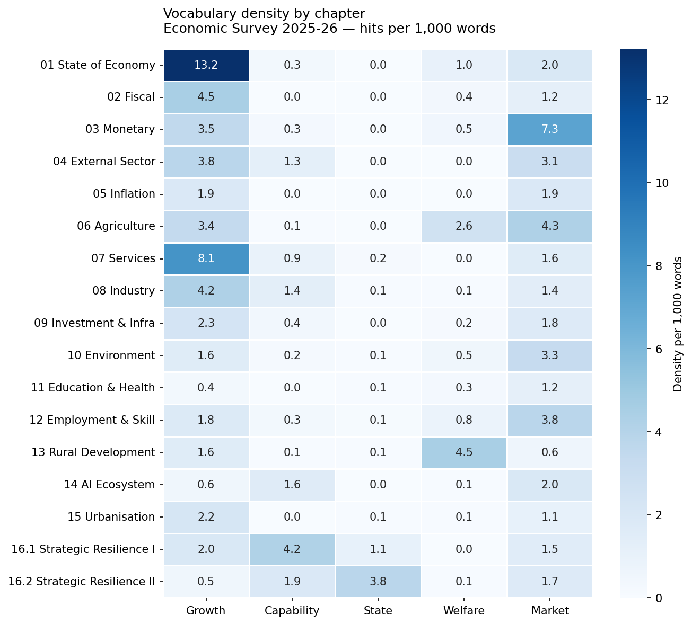
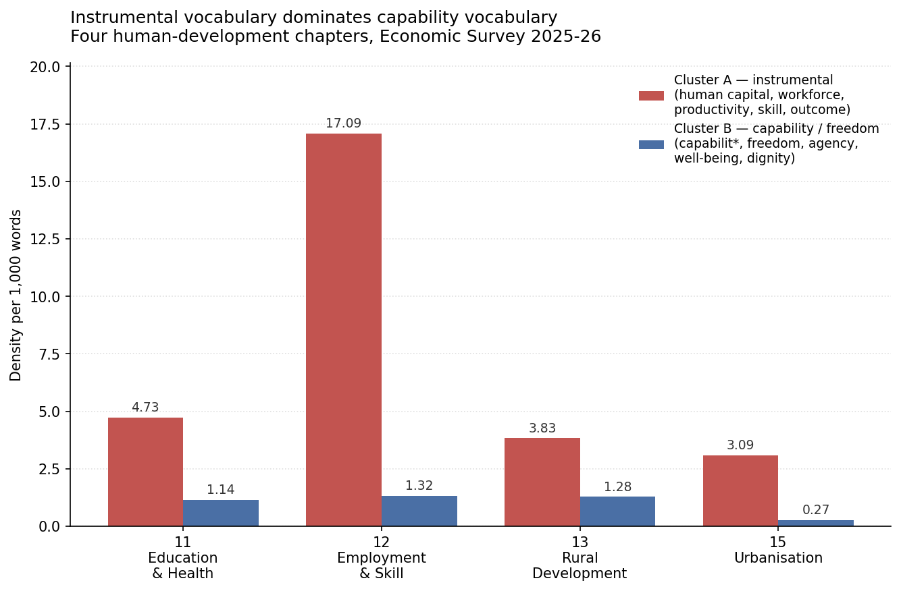
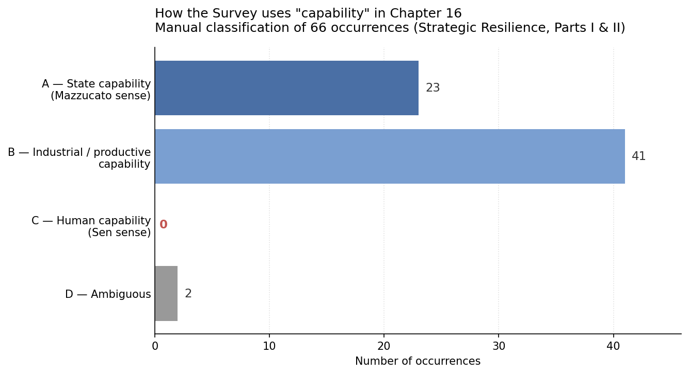
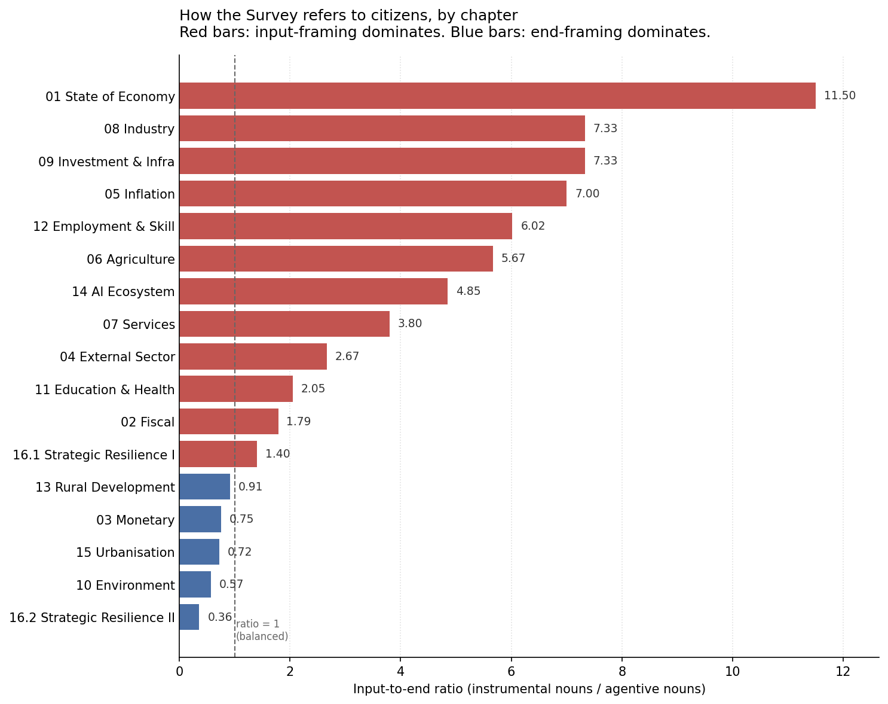
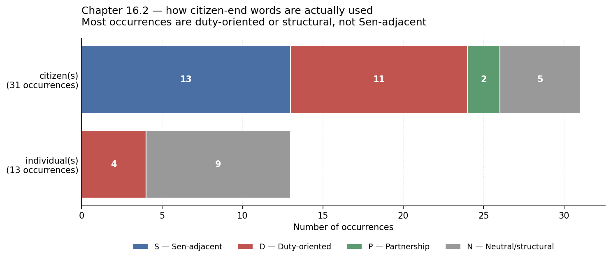

# From Growth to Capability

A text analysis of the Indian Economic Survey 2025-26, looking at how
the document uses Amartya Sen's capability vocabulary and Mariana
Mazzucato's state-led development vocabulary.

The project builds a SQLite database from the 740-page PDF, runs SQL
and Python analysis on the text, and documents what it finds.

---

## The question

The Economic Survey explicitly names Mazzucato and uses her phrase
"entrepreneurial state" as a section heading on page 644. Sen and
Nussbaum are not named anywhere in the document. But the word
*capability* appears in the body of the Survey hundreds of times.

So: does the Survey use *capability* in Sen's sense (citizens as
bearers of substantive freedoms), or in some other sense?
And in the chapters where Sen's framework would most naturally
apply — Education, Health, Employment, Rural Development — what
vocabulary does the Survey actually use?

---

## The finding (one paragraph)

Across 89,681 words spanning five chapters — Education & Health,
Employment & Skill, Rural Development, Urbanisation, and Strategic
Resilience — the words *capability* and *freedom* are not used in
Sen's sense even once. *Dignity* appears four times in Sen-adjacent
ways, but always as a rhetorical opener or scheme justification,
never as a structural concept. The dominant vocabulary in every
chapter is either instrumental (skill, outcome, productivity, human
capital, workforce) or state-capacity-oriented (institutional,
regulatory, strategic). Where the Survey speaks of citizens most
heavily (Chapter 16.2), the framing is overwhelmingly disciplinary —
citizens as norm-internalisers and duty-bearers — not as bearers of
substantive freedom. The Survey adopts Mazzucato's vocabulary
openly and Sen's not at all.

Full evidence in [`docs/findings.md`](docs/findings.md).
Method in [`docs/methodology.md`](docs/methodology.md).

---

## Charts

### Vocabulary density across the Survey

Five vocabulary clusters across all 17 chapters. State-capacity
language is concentrated in Chapter 16. Capability-language appears
most in Chapter 16 and the AI chapter — not in Education / Health.

### Instrumental vs capability vocabulary in human-development chapters

Four chapters where Sen's framework should most naturally apply.
Instrumental vocabulary dominates capability vocabulary in every
one of them.

### How "capability" is actually used in Chapter 16

All 66 occurrences of "capability" in Chapter 16, manually
classified. Industrial / productive uses dominate. State-capability
uses are common. Sen-sense human capability: zero.

### How the Survey refers to citizens

Ratio of input-framing nouns (worker, beneficiary, consumer, etc.)
to end-framing nouns (citizen, individual, person) per chapter.
Most chapters are input-dominant.

### How citizens are framed where they appear most

In Chapter 16.2, where citizen-end words appear most often, the
framing is overwhelmingly disciplinary or structural — not
Sen-adjacent.

---

## Tech stack

- **Python 3.13** — pdfplumber for extraction, pandas for data handling,
  matplotlib and seaborn for visualisation
- **SQLite** — single-file relational database, two tables
  (`chapters`, `pages`), foreign keys enforced, indexed for query speed
- **SQL** — analytical queries use CTEs, aggregations, and the
  `LENGTH/REPLACE` substring-counting pattern for keyword density

---

## Project structure

    economic-survey-capability-analysis/
    ├── data/
    │   ├── raw/                       # (gitignored) source PDF
    │   ├── interim/                   # extracted raw text + chapter map
    │   └── processed/                 # cleaned text + cleaning audit
    ├── db/
    │   └── survey.db                  # (gitignored) SQLite database
    ├── docs/
    │   ├── findings.md                # 6 findings + combined position
    │   └── methodology.md             # methods, choices, limitations
    ├── outputs/
    │   ├── ch16_capability_contexts.txt
    │   ├── sen_core_contexts_social_chapters.txt
    │   ├── ch16_2_citizen_contexts.txt
    │   └── charts/                    # 6 PNG charts
    ├── sql/
    │   ├── 01_schema.sql              # database schema
    │   └── analysis/                  # 6 analytical SQL queries
    ├── src/                           # Python pipeline + chart scripts
    ├── requirements.txt
    └── README.md

---

## How to reproduce

Requires Python 3.13 and the original PDF placed at
`data/raw/economic_survey_2025_26.pdf`.

    # 1. Set up environment
    python -m venv .venv
    .venv\Scripts\activate.bat
    pip install -r requirements.txt

    # 2. Run the pipeline end-to-end
    python src/01_explore_pdf.py
    python src/02_build_chapters_json.py
    python src/03_extract_chapters.py
    python src/04_clean_chapters.py
    python src/05_build_database.py

    # 3. Run analytical queries
    python src/run_sql.py sql/analysis/02_keyword_density_by_chapter.sql

    # 4. Render charts
    python src/09_chart_chapter_sizes.py
    python src/10_chart_keyword_density_heatmap.py
    # ... etc

The database build script is idempotent — it drops existing tables
and reloads from cleaned text files. The cleaned text files are
committed; the raw PDF is not.

---

## Limitations

Documented in full in [`docs/methodology.md`](docs/methodology.md).
In short: this is a text analysis, not an analysis of policy substance.
Absence of a word is not absence of the underlying idea. The project
also does not compare the 2025-26 Survey against earlier years.

---

## Author

Ashutosh Jayant. A portfolio project combining PDF extraction, SQL, and text
analysis with qualitative reading of a long policy document.
